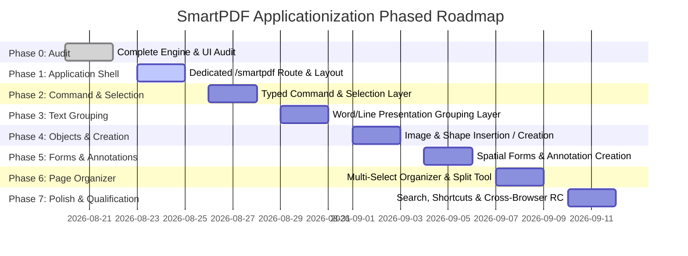

# SmartPDF Dedicated Application Architecture & Design Blueprint

## 1. Application Boundary & Routing Strategy

### A. Evaluated Architectures

| Architecture Option | Pros | Cons | Recommendation |
| :--- | :--- | :--- | :--- |
| **Option A: Same Next.js App + Dedicated Fullscreen Route (`/smartpdf`)** | Zero multi-repo overhead; shares UI library and WASM build pipeline; instant deployment; seamless transitions from ToolRakyat discovery landing pages. | Requires clean layout boundary bypassing marketing header/footer wrappers. | **`RECOMMENDED (DEFAULT)`** |
| **Option B: Turborepo / Monorepo Package (`apps/smartpdf`)** | Isolated package boundaries. | Increased build toolchain complexity and duplicated dependencies without immediate product need. | Not recommended for Phase 1. |
| **Option C: Separate Standalone Repository** | Strict isolation. | Substantially increases CI/CD maintenance and duplicates StarPDF engine bindings. | Not recommended. |

### B. Routing & Entry Surface
- **Marketing / Discovery Entry**: `https://toolrakyat.com/tools/pdf-editor` (or `/tools/smartpdf`) presents educational features, SEO landing, and prominent **"Open SmartPDF Desktop"** action button.
- **Dedicated Application Surface**: `https://toolrakyat.com/smartpdf` (or `/app/smartpdf`) launches the fullscreen, dedicated desktop web application shell with zero marketing headers, zero generic margins, and complete viewport control (`h-screen`, `w-screen`).

---

## 2. Desktop-Class Application Shell Layout

```
┌────────────────────────────────────────────────────────────────────────────────────────┐
│ [SmartPDF Logo]  File   Edit   View   Insert   Annotate   Pages   Help       [Export ▾]│
├────────────────────────────────────────────────────────────────────────────────────────┤
│ [Select ▾] [Text] [Image] [Shape] [Form] [Annotate] │ [🔍 Search] │ [Undo] [Redo] │ 🛡️ │
├───────────────┬────────────────────────────────────────────────────────────────────────┤
│ THUMBNAILS    │                                                                        │
│               │                                                                        │
│ ┌───────────┐ │                     PDF DOCUMENT WORKSPACE                             │
│ │   Page 1  │ │                                                                        │
│ └───────────┘ │                  [DIRECT MANIPULATION CANVAS]                          │
│ ┌───────────┐ │                                                                        │
│ │   Page 2  │ │           ┌─────────────────────────────────────────┐                  │
│ └───────────┘ │           │  Floating Contextual Action Toolbar     │                  │
│ ┌───────────┐ │           └─────────────────────────────────────────┘                  │
│ │   Page 3  │ │                                                                        │
│ └───────────┘ │                                                                        │
├───────────────┴────────────────────────────────────────────────────────────────────────┤
│ Page 2 of 14   │   100% Zoom [−][+]   │   Selection: Text Span   │   Local Processing  │
└────────────────────────────────────────────────────────────────────────────────────────┘
```

### Layout Regions
1. **Top Application Menu Bar** (56px): Application branding, file operations (Open, Add, Export, Close), native menus (`File`, `Edit`, `View`, `Insert`, `Pages`, `Help`), and primary Export Split-Button.
2. **Global Mode & Quick Action Bar** (44px): Active editing mode switches (`Select`, `Text`, `Image`, `Shape`, `Form`, `Annotate`), `Cmd+F` search toggle, Undo/Redo history buttons, and Local-First Privacy indicator.
3. **Left Thumbnail & Page Organizer Rail** (240px wide, collapsible): High-resolution page thumbnails, visual reordering, multi-select checkboxes, and quick page context menus.
4. **Dominant Center Canvas Viewport** (100% remaining horizontal space): Clean PDF page presentation, high-DPI canvas rendering, interactive hit-testing overlay, and floating contextual toolbars.
5. **Bottom Status Bar** (32px): Page navigation jumper (`Page X of Y`), zoom controls (`Fit Width`, `Fit Page`, slider), selection metadata readout, and WASM worker status.

---

## 3. Tool / Mode Interaction Model

| Tool Mode | Cursor | Hover Behavior | Canvas Click Behavior | Active Contextual Controls |
| :--- | :--- | :--- | :--- | :--- |
| **`SELECT` (Default)** | Default Pointer | Highlights topmost object boundary (Forms > Annots > Text > Image > Vector) | Selects object under cursor; empty canvas click clears selection | Floating contextual bar specific to selected object type |
| **`TEXT`** | Text I-Beam | Highlights contiguous text runs/lines | Focuses inline text editor; opens contextual edit bar | Replace input, font info, apply button, read-only refusal notice |
| **`IMAGE`** | Crosshair / Pointer | Outlines raster images on page | Selects image; enables replacement file chooser | Replace Image, Remove Image, Export Image, Shared Clone |
| **`SHAPE`** | Crosshair | Highlights existing vector shapes | Click selects shape; click-and-drag creates new rectangle/line | Stroke color, fill color, line width, delete shape |
| **`FORM`** | Pointer / Hand | Outlines interactive AcroForm widgets | Direct spatial click toggles checkbox/radio or focuses input | Text field input, checkbox toggle, dropdown option picker |
| **`ANNOTATE`** | Crosshair / Pen | Highlights existing markup annotations | Click selects annotation; click-and-drag creates new highlight/freetext | FreeText contents input, highlight color picker, delete annotation |
| **`PAGES`** | Default Pointer | Outlines full page tile | Selects page in thumbnail organizer | Move Left, Move Right, Duplicate, Delete, Insert Blank, Extract |

---

## 4. Command Architecture Layer

To prevent duplication of mutation, history, validation, and error-handling code across UI components, SmartPDF introduces a typed **Command Architecture Layer**:

```
[UI Trigger] ──> [Command Instance] ──> [CommandContext.execute()]
                                                 │
            ┌────────────────────────────────────┴───────────────────────────────────┐
            ▼                                                                        ▼
   1. Capability Pre-check                                                 2. StarPdfClient Mutation
      (Checks permissions, font validity, handle health)                      (Calls WASM via Worker Bridge)
            │                                                                        │
            └────────────────────────────────────┬───────────────────────────────────┘
                                                 ▼
                                     3. Transaction Verification
                                        (Validates returned byte stream)
                                                 ▼
                                     4. History Snapshot Push
                                        (Pushes Uint8Array snapshot to undo stack)
                                                 ▼
                                     5. State & Viewport Refresh
                                        (Updates pdfProxy, text spans, images, fields)
```

### Core Command Interfaces

```typescript
export interface CommandContext {
  doc: StarPdfDocumentHandle;
  currentPage: number;
  pushHistory: (bytes: Uint8Array, description: string) => void;
  refreshDocument: (newBytes: Uint8Array) => Promise<void>;
  setSelection: (selection: SmartPdfSelection | null) => void;
}

export interface SmartPdfCommand<TResult = void> {
  readonly id: string;
  readonly description: string;
  canExecute(context: CommandContext): boolean | Promise<boolean>;
  execute(context: CommandContext): Promise<TResult>;
}
```

### Standard Command Registry
- `ReplaceTextCommand(pageIndex, spanId, newText)`
- `ReplaceImageCommand(pageIndex, imageId, file)`
- `RemoveImageCommand(pageIndex, imageId)`
- `AddImageCommand(pageIndex, file, x, y, width, height)`
- `UpdateVectorCommand(input: StarPdfUpdateVectorGraphicInput)`
- `DeleteVectorCommand(pageIndex, graphicId)`
- `AddRectangleCommand(pageIndex, x, y, width, height, stroke, fill, width)`
- `AddLineCommand(pageIndex, x1, y1, x2, y2, stroke, width)`
- `SetFormFieldCommand(objectNum, objectGen, fieldType, value)`
- `AddAnnotationCommand(pageIndex, input: StarPdfAddAnnotationInput)`
- `UpdateAnnotationCommand(objectNum, objectGen, input: StarPdfUpdateAnnotationInput)`
- `DeleteAnnotationCommand(pageIndex, objectNum, objectGen)`
- `DeletePageCommand(pageIndex)`
- `MovePageCommand(fromIndex, toIndex)`
- `DuplicatePageCommand(pageIndex, destinationIndex)`
- `InsertBlankPageCommand(pageIndex, width, height, rotation)`
- `ExtractPagesCommand(pageIndices: number[])`
- `MergeDocumentsCommand(documents: Uint8Array[], pageSources?: PageSource[])`
- `SplitDocumentCommand(ranges: PageRange[])`

---

## 5. Object Selection & Hit-Testing Hierarchy

### Discriminated Union: `SmartPdfSelection`

```typescript
export type SelectionDomain = "none" | "text" | "image" | "vector" | "form" | "annotation" | "page";

export type SmartPdfSelection =
  | { type: "none" }
  | { type: "text"; id: string; span: StarPdfTextSpan; bounds: PixelRect }
  | { type: "image"; id: string; image: StarPdfImageInfo; bounds: PixelRect }
  | { type: "vector"; id: string; graphic: StarPdfVectorGraphicInfo; bounds: PixelRect }
  | { type: "form"; id: string; field: StarPdfFormField; bounds: PixelRect }
  | { type: "annotation"; id: string; annotation: StarPdfAnnotation; bounds: PixelRect }
  | { type: "page"; pageIndex: number; selectedPages: Set<number> };
```

### Deterministic Hit-Testing Z-Index Hierarchy
1. **`z-10` Vector Graphics**: Background shapes, rules, colored fills.
2. **`z-15` Raster Images**: Photos, figures, embedded raster assets.
3. **`z-20` Text Spans / Runs**: Glyph text runs.
4. **`z-25` Markup Annotations**: Highlights, sticky notes, underlines, stamps, links.
5. **`z-30` Form Fields / Widgets**: Interactive inputs, checkboxes, radios, dropdowns.
6. **`z-40` Active Selection Highlight**: Focus ring (`ring-2 ring-sky-500`), elevation drop-shadow.

---

## 6. Text Presentation Grouping Layer (High Priority)

### Problem Statement
In real-world PDFs, words and sentences are often broken into dozens of tiny individual character spans. Clicking a 3-pixel wide single letter target is difficult for users.

### Architectural Solution
SmartPDF introduces a **Client Presentation Grouping Layer**:

```
[StarPDF Raw Text Spans]
(e.g., span_0: "Sm", span_1: "art", span_2: "P", span_3: "DF")
                           │
                           ▼
          [Text Presentation Grouping Engine]
   (Groups spans with matching Y-baseline, font, size, & spatial proximity)
                           │
                           ▼
[Selectable Visual Word Run: "SmartPDF"]
   ├── Composite Bounding Box: { left: 50, top: 100, width: 72, height: 14 }
   └── Underlying Span Map: [span_0, span_1, span_2, span_3]
                           │
                           ▼
            [User Clicks Word / Line]
   └── UI presents editable word replacement: "SmartPDF v0.20"
   └── Dispatches exact StarPDF replacement across mapped span IDs.
```

---

## 7. Professional Page Organizer & Multi-Document Model

### Left Rail Capabilities (Page Mode)
1. **Multi-Select & Range Selection**:
   - Single Click: Selects page.
   - `Cmd / Ctrl + Click`: Toggles individual page into multi-select set.
   - `Shift + Click`: Selects continuous range of pages (e.g. Page 3 to Page 9).
2. **Batch Actions Bar** (Appears when `selectedPages.size > 1`):
   - `Delete Selected (N)`
   - `Duplicate Selected (N)`
   - `Extract Selected (N) as Standalone PDF`
   - `Rotate Selected (90° Clockwise / Counter-Clockwise)`
3. **Multi-Document Tray**:
   - Drag-and-drop external PDF files into the Left Rail to insert at exact insertion index.
   - Triggers `starpdf_insert_imported_page` or `starpdf_merge_selected`.
4. **Split Document Dialog**:
   - Visual range builder: `Part 1 (pp. 1-5)`, `Part 2 (pp. 6-12)`, `Part 3 (pp. 13-20)`.
   - Dispatches `starpdf_split_document` and downloads multi-file ZIP.

---

## 8. Desktop Keyboard Map

| Shortcut | Command / Action | Notes |
| :--- | :--- | :--- |
| **`Cmd/Ctrl + O`** | Open File Dialog | Prompts unsaved changes if dirty |
| **`Cmd/Ctrl + S`** | Export Editable PDF | Default fast save action |
| **`Cmd/Ctrl + Shift + S`** | Open Export Options Menu | Editable vs. Flattened selection |
| **`Cmd/Ctrl + Z`** | Undo Last Operation | Reverts history stack snapshot |
| **`Cmd/Ctrl + Shift + Z`** / **`Cmd+Y`** | Redo Last Operation | Re-applies history stack snapshot |
| **`Cmd/Ctrl + F`** | Toggle Find in Document | Focuses search bar |
| **`Escape`** | Clear Selection / Close Modal | Deselects active object |
| **`Delete` / `Backspace`** | Delete Selected Object / Page | Confirmation for page deletion |
| **`Cmd/Ctrl + [`** / **`PageUp`** | Previous Page | Navigates page backward |
| **`Cmd/Ctrl + ]`** / **`PageDown`** | Next Page | Navigates page forward |
| **`Cmd/Ctrl + 0`** | Fit Page to Viewport | Scales page to 100% visible height |
| **`Cmd/Ctrl + 1`** | Fit Width to Viewport | Scales page to 100% visible width |
| **`Cmd/Ctrl + +`** / **`Cmd+Scroll`** | Zoom In (+10%) | Bounded to 500% |
| **`Cmd/Ctrl + -`** | Zoom Out (-10%) | Bounded to 25% |

---

## 9. Phased Implementation Roadmap



- **Phase 1: Dedicated SmartPDF Application Shell + Routing**: Fullscreen desktop shell (`/smartpdf`), top menu bar, global mode bar, status bar.
- **Phase 2: Unified Command & Selection Layer**: Centralized `SmartPdfCommand` infrastructure and `SmartPdfSelection` discriminated union.
- **Phase 3: Text Presentation Grouping Refinement**: Visual line/word grouping for human-scale text editing over granular glyph spans.
- **Phase 4: Direct Shape & Image Creation**: "Insert Image", "Add Rectangle", "Add Line" tools wired to existing StarPDF APIs.
- **Phase 5: Forms & Annotation Creation**: Direct spatial form controls, annotation creation tools (Highlight, FreeText, Square), and annotation deletion.
- **Phase 6: Professional Page Organizer & Multi-Doc**: Multi-select thumbnail rail, batch delete/duplicate/extract, multi-range document split dialog.
- **Phase 7: Search, Keyboard & Product Polish**: Bounding-box search highlights, complete keyboard shortcut map, responsive high-DPI canvas.
- **Phase 8: Full RC Qualification**: Vitest, Lint, Typecheck, Next.js build, and 180+ Playwright cross-browser tests across Chromium, Firefox, WebKit.
