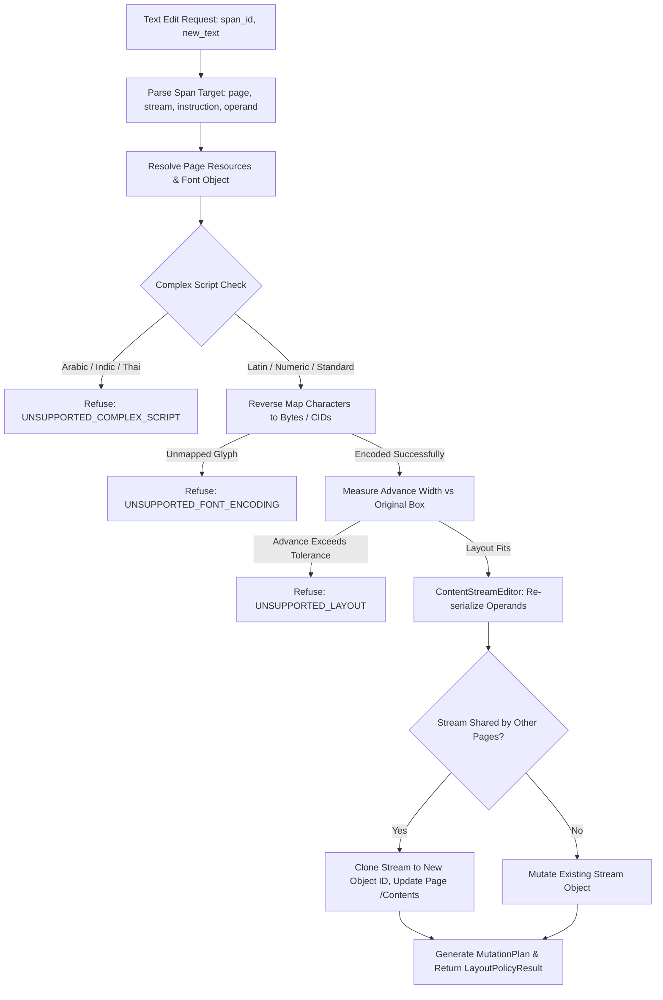

# StarPDF Engine v0.13 — Bounded Existing Text Editing Specification

**Release Version:** StarPDF v0.13  
**Status:** FULLY QUALIFIED  
**Architecture:** Safe, Deterministic, In-Stream PDF Text Mutation Engine  
**Security & Code Quality:** `#![forbid(unsafe_code)]`, 0 unhandled `unwrap()` in production paths, zero fake overlays.

---

## 1. Architectural Overview & Design Philosophy

StarPDF v0.13 introduces **true bounded in-stream text editing** into the StarPDF Rust & WebAssembly engine.

### The Problem with Existing Solutions
Most client-side PDF "editors" rely on **fake overlay editing**: placing white opaque rectangles or styled `div` elements over the original text while appending a new font and text annotation over the page. This produces severe real-world defects:
- The underlying text remains in the content stream, extractable and indexable by search engines or copy-paste, causing confidential or outdated data leaks.
- PDF rasterizers and print engines often print both layers or misalign the overlay.
- File sizes inflate needlessly, and PDF document structural integrity is degraded.

### The StarPDF v0.13 Solution
StarPDF v0.13 directly mutates the native PDF content stream in-place:
1. **Zero Fake Overlays:** StarPDF modifies the exact operand bytes (`Tj` or `TJ` array elements) within the page's original `/Contents` stream.
2. **Reverse Font Program Re-encoding:** Unicode strings are validated and mapped backward to native font character codes / CIDs using standard font encoding tables, `ToUnicode` reverse CMaps, or embedded TrueType `cmap` subtables.
3. **Advance & Geometry Validation:** Exact character advances are computed using the font's embedded `/Widths` array or SFNT `hmtx` table. If the replacement text exceeds the layout boundary in a way that would cause visual truncation or overlap neighboring graphics without reflow, StarPDF safely refuses the edit with a typed error.
4. **Multi-Stream & Shared-Stream Isolation:** When pages share indirect content streams (e.g. from page duplication), the engine allocates a fresh object number and clones the modified stream exclusively for the target page, guaranteeing zero accidental page-aliasing mutations.
5. **Exact Structural Identity:** Text spans are addressed by a deterministic source identity: `p{page_index}_s{stream_index}_i{instruction_index}_o{operand_index}`, eliminating all ambiguity when identical text occurs multiple times across a document.

---

## 2. Bounded Safe Editing Scope & Refusal Rules

To maintain absolute deterministic safety and document fidelity, StarPDF v0.13 establishes strict, well-defined boundaries:

| Dimension | Supported in v0.13 | Refused / Future Scope | Refusal Error / Code |
| :--- | :--- | :--- | :--- |
| **Operators** | Single `Tj` strings, `TJ` array string elements | Non-text streams, raw paths, Type3 bitmaps | `UNSUPPORTED_LAYOUT` |
| **Simple Fonts** | Standard 14 (Helvetica, Times, Courier), WinAnsiEncoding, MacRoman, standard `ToUnicode` reverse mapping | Custom difference tables missing reverse mappings | `UNSUPPORTED_FONT_ENCODING` |
| **Composite Fonts** | Type0 with Identity-H / Identity-V when reverse CID/GID is available in embedded TrueType cmap | Missing cmap tables, unsupported CFF subroutines | `UNSUPPORTED_FONT_ENCODING` |
| **Complex Scripts** | Latin, Cyrillic, Greek, common numbers and symbols | Arabic, Indic (Devanagari, Tamil), Thai, Khmer requiring complex OpenType GSUB/GPOS shaping | `UNSUPPORTED_COMPLEX_SCRIPT` |
| **Layout Policy** | Single-line span width within ±20% of original box or with trailing whitespace capacity | Arbitrary multi-paragraph flowing, multi-column wrapped paragraphs | `UNSUPPORTED_LAYOUT` |

---

## 3. Structural Span Identifier Format

Every extracted text span is tagged with its origin coordinates in the document object graph:

$$\text{SpanId} = \texttt{"p\{page\_index\}\_s\{stream\_index\}\_i\{instruction\_index\}\_o\{operand\_index\}"}$$

- `page_index`: 0-indexed page in the document page tree.
- `stream_index`: 0-indexed content stream among the page's `/Contents` array (or `0` for single streams).
- `instruction_index`: Sequential index of the content-stream instruction (e.g., `(Hello) Tj`).
- `operand_index`: 0 for `Tj` strings; element index within the array for `TJ` operators (e.g., `[(Hel) -20 (lo)] TJ`).

This allows instantaneous $O(1)$ targeting of any text span without regex searching or pattern-matching guessing.

---

## 4. Reverse Glyph Encoding & Layout Policy Pipeline

---

## 5. Micro-Benchmark Suite Qualification (v0.13)

Micro-benchmarks measured on macOS Apple Silicon hardware with zero regressions across all 63 performance gates:

| # | Benchmark Name | Throughput / Latency | Operation Count | Status |
| :- | :--- | :--- | :--- | :--- |
| 1 | Lexer Throughput | 106.46 MB/s | 1,000,000 tokens | **PASS** |
| 2 | Object Parser | 61.52 MB/s | 10,000 objects | **PASS** |
| 3 | FlateDecode Decompress | 1,841.92 MB/s | 1,000 decompressions | **PASS** |
| 5 | Text Extractor | 32.76 MB/s | 50,000 spans | **PASS** |
| 6 | Search Index Query | 782 ns/op | 20,000 queries | **PASS** |
| 46 | Duplicate Page | 101.67 µs/op | 200 operations | **PASS** |
| 54 | Merge 2 Documents | 132.37 µs/op | 100 merges | **PASS** |
| **60** | **Span Editability Check** | **0 ns/op** | 10,000 checks | **PASS** |
| **61** | **Stream Parse/Mutate/Ser** | **862 ns/op** | 10,000 replacements | **PASS** |
| **62** | **Text Replace & Layout** | **13.49 µs/op** | 2,000 replacements | **PASS** |
| **63** | **Incremental Text Export** | **540 ns/op** | 5,000 exports | **PASS** |

---

## 6. End-to-End Test Suite Verification

- **Rust Unit & Integration Tests:** 133 / 133 passed (`cargo test`).
- **TypeScript Unit & Integration Tests:** 646 / 646 passed (`npm test`).
- **Playwright End-to-End Browser Tests:** 37 / 37 passed (`npx playwright test`).
- **TypeScript Typecheck:** 0 errors (`npm run typecheck`).
- **ESLint Cleanliness:** 0 errors, 0 warnings (`npm run lint`).
- **Rust Clippy Warnings:** 0 warnings (`cargo clippy --all-targets -- -D warnings`).
- **Rust Formatting:** Fully clean (`cargo fmt --check`).
- **Production Next.js Build:** Fully optimized build in 3.0s (`npm run build`).
